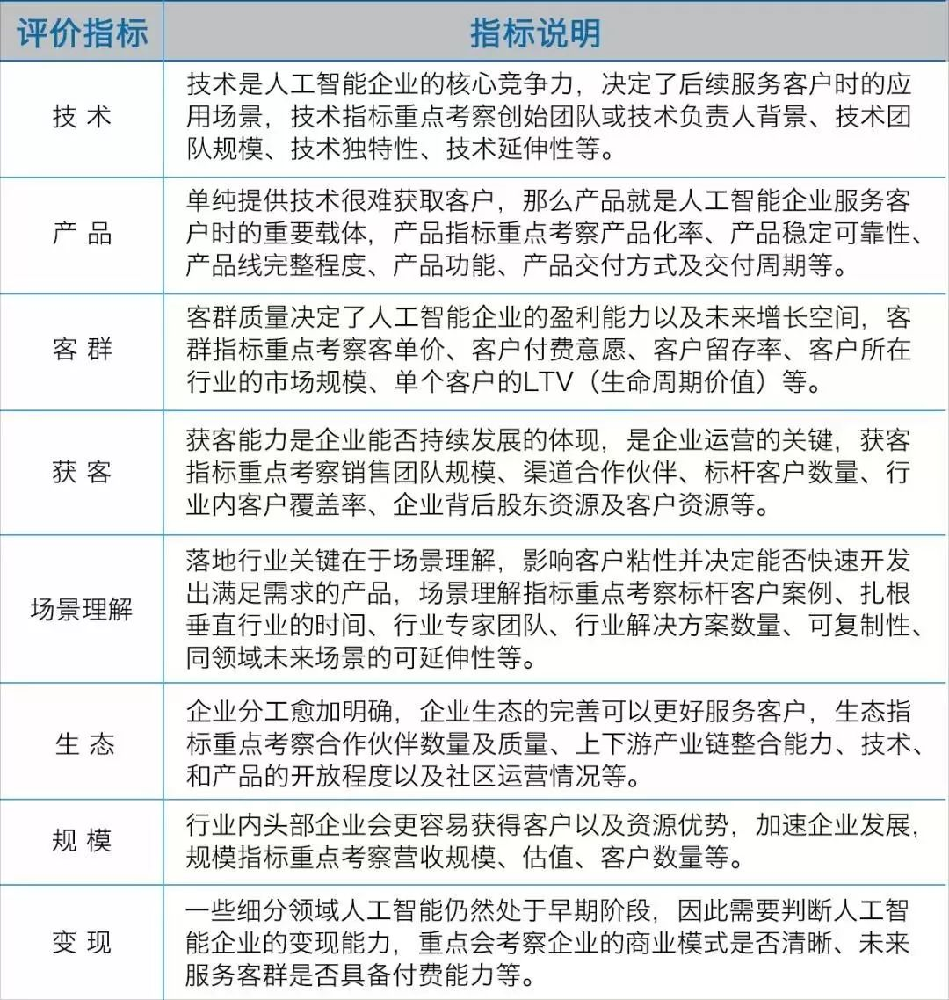
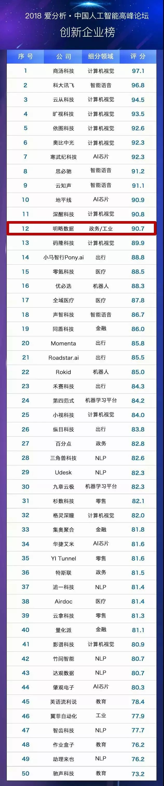

企业竞争力评估

**竞争力评分=企业竞争力模型得分\*行业系数**

**（1）企业竞争力模型得分：**评价指标包括技术、产品、客群、获客、场景理解、生态、规模等，根据企业所在行业特点，选取最重要的4-6个维度，给予不同权重进行评分，各指标权重总和为1。

**（2）行业系数：**为了对不同细分行业的公司进行比较，爱分析综合考虑行业规模及增速、市场集中度、技术渗透率等影响公司发展前景的重要市场因素，得出行业系数，行业系数分布区间为【0.85,1.0】。

1. 从上述方面衡量一个企业的竞争力，可用于企业信贷评级模型中；
2. 企业更好地发展可参照以上几个方面制定战略。个人的发展呢？

