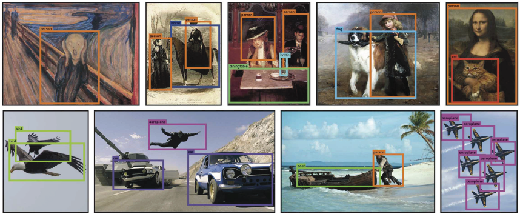
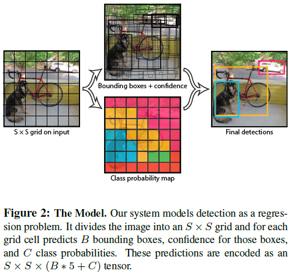
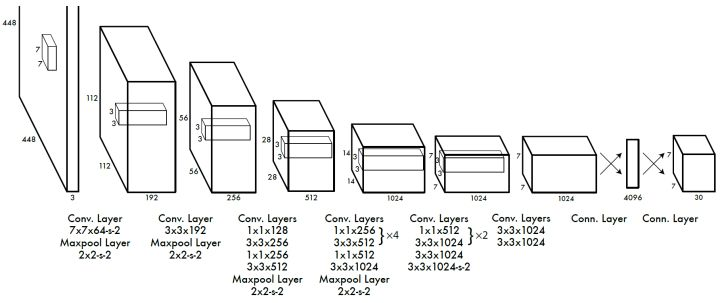
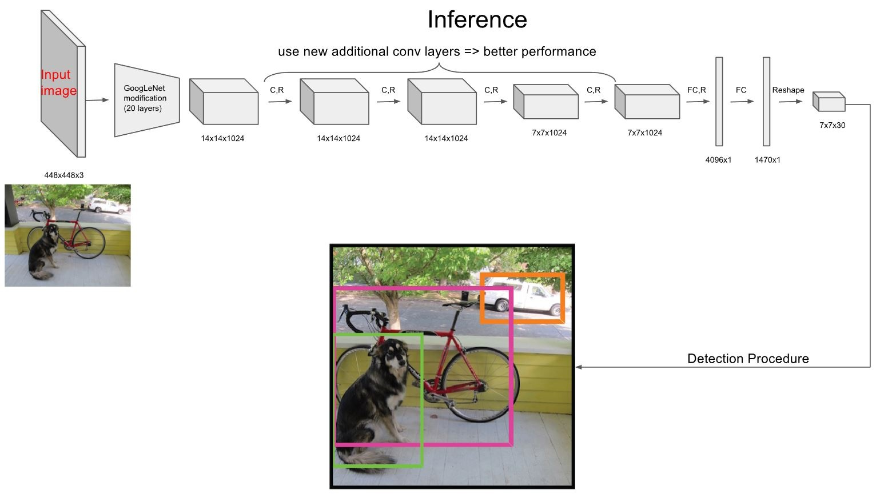
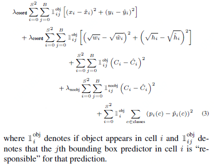
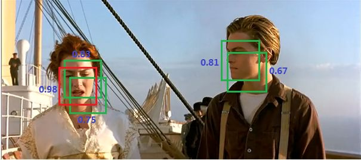

### 候选区域生成方法回顾

#### 1. 滑动窗口方法

**原理**

将检测问题转化为图像分类问题。其基本原理就是采用不同大小和比例（宽高比）的窗口在整张图片上以一定的步长进行滑动，然后对这些窗口对应的区域做图像分类，从而实现对整张图片的检测。DPM就是采用这种思路。

**缺点**

不知道要检测目标的大小，所以需要设置不同大小和比例的窗口去滑动，而且还要选取合适的步长。但是这样会产生很多的子区域，并且都要经过分类器去做预测，这需要很大的计算量。

#### 2. selective search方法

**原理**

图像中物体可能存在的区域应该是有某些相似性或者连续性区域的。因此，选择搜索基于上面这一想法采用**子区域合并**的方法进行提取bounding boxes候选边界框。主要步骤如下：

1. 对输入图像进行分割产生许多小的子区域。

2. 根据这些子区域之间相似性(相似性标准主要有颜色、纹理、大小等等)进行区域合并，不断的进行区域迭代合并。每次迭代过程中对这些合并的子区域做bounding boxes(外切矩形)，这些子区域外切矩形就是通常所说的候选框。

**缺点**

需定义子区域相似性的度量算法。

#### 3. 全卷积滑动窗口方法

**原理**

网络中用卷积层代替了全连接层，如下图所示。输入图片大小是16x16，经过一系列卷积操作，提取了2x2的特征图，但是这个2x2的图上每个元素都是和原图是一一对应的，如图上蓝色的格子对应蓝色的区域，这就相当于在原图上做大小为14x14的窗口滑动，且步长为2，共产生4个子区域。最终输出的通道数为4（类别的个数），可以看成每个子区域属于4个类别的预测概率值，这样一次CNN计算就可以实现窗口滑动的所有子区域的分类预测。之所以CNN可以实现这样的效果是因为卷积操作的特性，就是图片的空间位置信息的不变性，尽管卷积过程中图片大小减少，但是位置对应关系还是保存的。

这是Overfeat算法的思路。这个思路也被R-CNN借鉴，从而诞生了Fast R-CNN算法。

滑动窗口的CNN实现(来源：deeplearning.ai)

**缺点**

尽管可以减少滑动窗口的计算量，但是只是针对一个固定大小与步长的窗口，这是远远不够的。

#### 4. YOLO候选区域生成方法

**原理**

直接将原始图片分割成**互不重合**的小方块，然后通过卷积最后生产这样大小的特征图，基于上面的分析，可以认为特征图的每个元素也是对应原始图片的一个小方块，然后用每个元素来预测那些中心点在该小方格内的目标。

### YOLO设计理念

Yolo算法采用一个单独的CNN模型实现end-to-end的目标检测，首先将输入图片resize到448x448，然后送入CNN网络，最后处理网络预测结果得到检测的目标。

具体来讲，Yolo的CNN网络将输入的图片分割成S*S 网格，然后每个单元格负责去检测那些中心点落在该格子内的目标。每个单元格会预测B个边界框（bounding box）以及边界框的置信度（confidence score）。

> 超参数S如何设定？边界框的大小和长款比例如何设定？

#### 目标定位

**置信度**包含两个方面，即 ：

1. 这个边界框含有目标的可能性大小，记为  ，当该边界框是背景时（即不包含目标），此时  。而当该边界框包含目标时，  。
2. 边界框的准确度，记为  ，用预测框与实际框（ground truth）的IOU（intersection over union，交并比）来表征。

**边界框的大小与位置**

1. 用4个值来表征：  ，其中  是边界框的中心坐标，而  和  是边界框的宽与高。中心坐标的预测值  是相对于每个单元格左上角坐标点的偏移值，并且单位是相对于单元格大小的，单元格的坐标定义如下图所示。而边界框的  和  预测值是相对于整个图片的宽与高的比例，这样理论上4个元素的大小应该在 ![[0,1]](imgs/equation-1539652834259.svg) 范围。

   > 为什么中心坐标的预测值（x，y）的大小在[0, 1]范围内？

每个边界框的预测值实际上包含5个元素：  ，其中前4个表征边界框的大小与位置，而最后一个值是置信度。

#### 目标分类

对于每一个单元格其还要给出预测出  个类别概率值，其表征的是由该单元格负责预测的边界框其目标属于各个类别的概率。但是这些概率值其实是在各个边界框置信度下的条件概率，即  。值得注意的是，不管一个单元格预测多少个边界框，其只预测一组类别概率值，这是Yolo算法的一个缺点。

> 如何从多个边界框中选出一个进行类别预测？这样做有什么坏处？

各个边界框类别置信度（class-specific confidence scores）: 

 。

边界框类别置信度表征的是该边界框中目标属于各个类别的可能性大小以及边界框匹配目标的好坏。后面会说，一般会根据类别置信度来过滤网络的预测框。

### 网络设计

Yolo采用卷积网络来提取特征，然后使用全连接层来得到预测值。网络结构参考GooLeNet模型，包含24个卷积层和2个全连接层。对于卷积层，主要使用1x1卷积来做channel reduction，然后紧跟3x3卷积。对于卷积层和全连接层，采用Leaky ReLU激活函数：  。但是最后一层却采用线性激活函数。

网络的最后输出为  大小的张量。对于每一个单元格，前20个元素是类别概率值，然后2个元素是边界框置信度，两者相乘可以得到类别置信度，最后8个元素是边界框的  。这样排列是为了计算方便，可以方便地提取每一个部分。首先网络的预测值是一个二维张量  ，其shape为 ![[batch, 7\times 7\times 30]](imgs/equation-1539909811888.svg) 。采用切片，那么 ![P_{[:,0:7*7*20]}](imgs/equation-1539909811887.svg) 就是类别概率部分，而 ![P_{[:,7*7*20:7*7*(imgs/equation-1539909811887.svg)]}](https://www.zhihu.com/equation?tex=P_%7B%5B%3A%2C7%2A7%2A20%3A7%2A7%2A%2820%2B2%29%5D%7D) 是置信度部分，最后剩余部分 ![P_{[:,7*7*(imgs/equation-1539909811887.svg):]}](https://www.zhihu.com/equation?tex=P_%7B%5B%3A%2C7%2A7%2A%2820%2B2%29%3A%5D%7D) 是边界框的预测结果。这样，提取每个部分是非常方便的，这会方面后面的训练及预测时的计算。

### 网络训练

在训练之前，先在ImageNet上进行了预训练，其预训练的分类模型采用图8中前20个卷积层，然后添加一个average-pool层和全连接层。预训练之后，在预训练得到的20层卷积层之上加上随机初始化的4个卷积层和2个全连接层。由于检测任务一般需要更高清的图片，所以将网络的输入从224x224增加到了448x448。整个网络的流程如下图所示：

##### **训练损失函数的分析**

Yolo算法将目标检测看成回归问题，所以采用的是均方差损失函数。但是对不同的部分采用了不同的权重值。

**定位误差**

采用较大的权重 

较小的边界框的坐标误差应该要比较大的边界框要更敏感。为了保证这一点，将网络的边界框的宽与高预测改为对其平方根的预测，即预测值变为  。

**分类误差**

区分不包含目标的边界框与含有目标的边界框的置信度，对于前者，采用较小的权重值  。其它权重值均设为1。

置信度的target值  ，如果是不存在目标，此时由于 ，那么  。如果存在目标，  ，此时需要确定  ，当然你希望最好的话，可以将IOU取1，这样  ，但是在YOLO实现中，使用了一个控制参数rescore（默认为1），当其为1时，IOU不是设置为1，而就是计算truth和pred之间的真实IOU。

另外一点时，由于每个单元格预测多个边界框。但是其对应类别只有一个。那么在训练时，如果该单元格内确实存在目标，那么只选择与ground truth的IOU最大的那个边界框来负责预测该目标，而其它边界框认为不存在目标。这样设置的一个结果将会使一个单元格对应的边界框更加专业化，其可以分别适用不同大小，不同高宽比的目标，从而提升模型性能。大家可能会想如果一个单元格内存在多个目标怎么办，其实这时候Yolo算法就只能选择其中一个来训练，这也是Yolo算法的缺点之一。要注意的一点是，对于不存在对应目标的边界框，其误差项就是只有置信度，坐标项误差和分类误差项是没法计算的。

##### 损失函数

其中第一项是边界框中心坐标的误差项。第二项是边界框的高与宽的误差项。第三项是包含目标的边界框的置信度误差项。第四项是不包含目标的边界框的置信度误差项。而最后一项是包含目标的单元格的分类误差项，  指的是第  个单元格存在目标。

### 网络预测

##### **非极大值抑制算法（non maximum suppression, NMS）**

主要解决的是一个目标被多次检测的问题，如图人脸检测，可以看到人脸被多次检测，但是其实我们希望最后仅仅输出其中一个最好的预测框，比如对于美女，只想要红色那个检测结果。那么可以采用NMS算法来实现这样的效果：首先从所有的检测框中找到置信度最大的那个框，然后挨个计算其与剩余框的IOU，如果其值大于一定阈值（重合度过高），那么就将该框剔除；然后对剩余的检测框重复上述过程，直到处理完所有的检测框。

#### Yolo的预测过程

这里我们不考虑batch，认为只是预测一张输入图片。根据前面的分析，最终的网络输出是  ，但是我们可以将其分割成三个部分：类别概率部分为 ![[7, 7, 20]](imgs/equation-1539912719160.svg) ，置信度部分为 ![[7,7,2]](imgs/equation-1539912719160.svg) ，而边界框部分为 ![[7,7,2,4]](imgs/equation-1539912719158.svg) （对于这部分不要忘记根据原始图片计算出其真实值）。然后将前两项相乘（矩阵 ![[7, 7, 20]](imgs/equation-1539912719160.svg) 乘以 ![[7,7,2]](imgs/equation-1539912719160.svg) 可以各补一个维度来完成 ![[7,7,1,20]\times [7,7,2,1]](imgs/equation-1539912719161.svg) ）可以得到类别置信度值为 ![[7, 7,2,20]](imgs/equation-1539912719160.svg) ，这里总共预测了  个边界框。

所有的准备数据已经得到了，那么我们先说第一种策略来得到检测框的结果，我认为这是最正常与自然的处理。首先，对于每个预测框根据类别置信度选取置信度最大的那个类别作为其预测标签，经过这层处理我们得到各个预测框的预测类别及对应的置信度值，其大小都是 ![[7,7,2]](https://www.zhihu.com/equation?tex=%5B7%2C7%2C2%5D) 。一般情况下，会设置置信度阈值，就是将置信度小于该阈值的box过滤掉，所以经过这层处理，剩余的是置信度比较高的预测框。最后再对这些预测框使用NMS算法，最后留下来的就是检测结果。一个值得注意的点是NMS是对所有预测框一视同仁，还是区分每个类别，分别使用NMS。Ng在deeplearning.ai中讲应该区分每个类别分别使用NMS，但是看了很多实现，其实还是同等对待所有的框，我觉得可能是不同类别的目标出现在相同位置这种概率很低吧。

上面的预测方法应该非常简单明了，但是对于Yolo算法，其却采用了另外一个不同的处理思路（至少从C源码看是这样的），其区别就是先使用NMS，然后再确定各个box的类别。其基本过程如图12所示。对于98个boxes，首先将小于置信度阈值的值归0，然后分类别地对置信度值采用NMS，这里NMS处理结果不是剔除，而是将其置信度值归为0。最后才是确定各个box的类别，当其置信度值不为0时才做出检测结果输出。这个策略不是很直接，但是貌似Yolo源码就是这样做的。Yolo论文里面说NMS算法对Yolo的性能是影响很大的，所以可能这种策略对Yolo更好。但是我测试了普通的图片检测，两种策略结果是一样的。

### 算法性能分析

这里看一下Yolo算法在PASCAL VOC 2007数据集上的性能，这里Yolo与其它检测算法做了对比，包括DPM，R-CNN，Fast R-CNN以及Faster R-CNN。其对比结果如表1所示。与实时性检测方法DPM对比，可以看到Yolo算法可以在较高的mAP上达到较快的检测速度，其中Fast Yolo算法比快速DPM还快，而且mAP是远高于DPM。但是相比Faster R-CNN，Yolo的mAP稍低，但是速度更快。所以。Yolo算法算是在速度与准确度上做了折中。

表1 Yolo在PASCAL VOC 2007上与其他算法的对比

为了进一步分析Yolo算法，文章还做了误差分析，将预测结果按照分类与定位准确性分成以下5类：

- Correct：类别正确，IOU>0.5；（准确度）
- Localization：类别正确，0.1 < IOU<0.5（定位不准）；
- Similar：类别相似，IOU>0.1；
- Other：类别错误，IOU>0.1；
- Background：对任何目标其IOU<0.1。（误把背景当物体）

Yolo与Fast R-CNN的误差对比分析如下图所示：

图13 Yolo与Fast R-CNN的误差对比分析

可以看到，Yolo的Correct的是低于Fast R-CNN。另外Yolo的Localization误差偏高，即定位不是很准确。但是Yolo的Background误差很低，说明其对背景的误判率较低。Yolo的那篇文章中还有更多性能对比，感兴趣可以看看。

**Yolo的优缺点**

优点：

- Yolo采用一个CNN网络来实现检测，是单管道策略，其训练与预测都是end-to-end，所以Yolo算法比较简洁且速度快。
- 由于Yolo是对整张图片做卷积，所以其在检测目标有更大的视野，它不容易对背景误判。全连接层也是对这个有贡献的，因为全连接起到了attention的作用。
- Yolo的泛化能力强，在做迁移时，模型鲁棒性高。

缺点：

- Yolo各个单元格仅仅预测两个边界框，而且属于一个类别。
- 如果一个单元格内存在多个目标怎么办，其实这时候Yolo算法就只能选择其中一个来训练。
- 对于小物体，Yolo的表现会不如人意。这方面的改进可以看SSD，其采用多尺度单元格。也可以看Faster R-CNN，其采用了anchor boxes。
- Yolo对于在物体的宽高比方面泛化率低，就是无法定位不寻常比例的物体。当然Yolo的定位不准确也是很大的问题。

### 小结

### 参考

1. [YOLO原理与实现](https://zhuanlan.zhihu.com/p/32525231)
2. [YOLO实现](https://github.com/gliese581gg/YOLO_tensorflow)