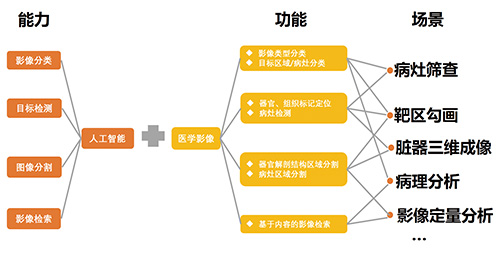
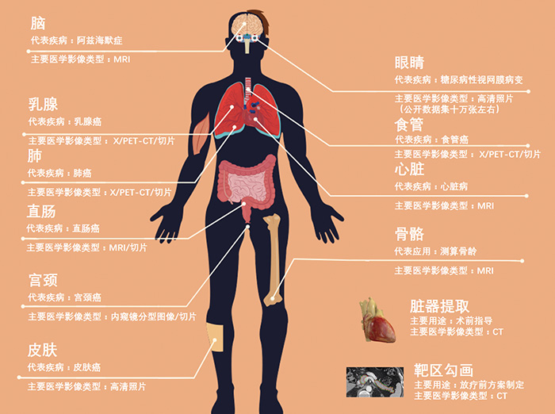
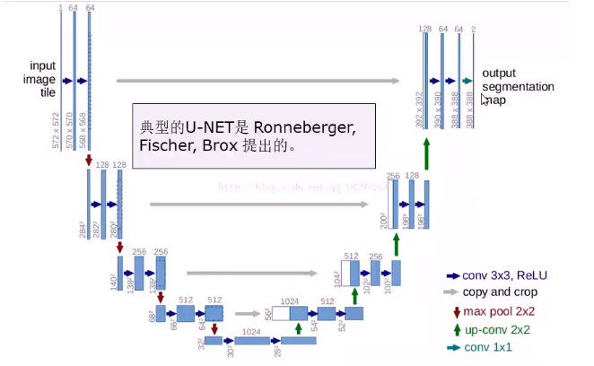
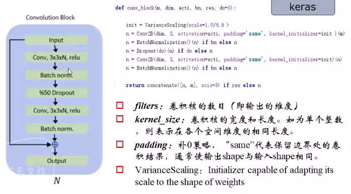
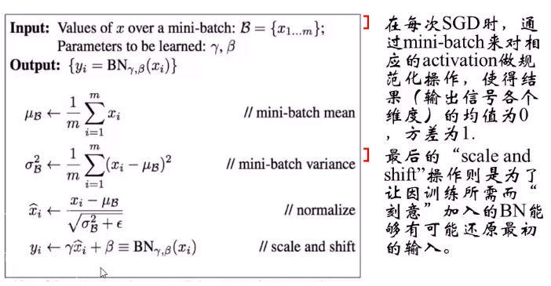

# 深度学习技术在医疗健康行业的应用

医学影像

电子病历

基因组学/个性化医疗

药物发现

移动医疗

## 深度学习在临床检测及医学影像中的应用

在医学影像领域的应用

应用场景

### 医学影像开源数据集

1. Github上哈佛 beamandrew机器学习和医学影像研究者-贡献的数据集

   github: https://github.com/beamandrew/medical-data

2. ISBI（生物医学成像国际研讨会）

   下载地址：https://grand-challenge.org/challenges/

3. 

### 医学影像分割

#### 任务

肺结节

MRI影像中的前列腺组织进行分割：判断每个影像是否属于前列腺组织

#### 特点

#### 深度学习模型

U-Net

V-Net

### 数据集来源

prostateX数据集

promise12数据集：下载地址

训练集：50列，测试集：30例

数据格式：mhd/raw格式的MRI影像

label：segmentation

### 医学影像开源数据集

1. Github上哈佛 beamandrew机器学习和医学影像研究者-贡献的数据集

   github: https://github.com/beamandrew/medical-data

2. ISBI（生物医学成像国际研讨会）

   下载地址：https://grand-challenge.org/challenges/

### 深度学习图像分割算法

2D U-NET、3D U-NET、DeeplabV3+  paslvoc

#### 传统图像分割算法

1. 基于图像灰度值阈值的划分
2. 基于区域生长的方法：以灰度色差作为基准

#### U-NET

SimpleITK包解读dicom图像	

图像输入、图像输出

卷积、下采样、上采样（双线性插值、反卷积）

典型的编码、解码框架

### 改进的U-NET

github.com/mirzaevinom/promise12_segmentation (promise12大赛第8名)

- 预处理（增大对比度、去噪）
- 网络体系结构
- 数据增强（弹性变形）

### 图像预处理技术--CLAHE算法

限制对比度自适应直方图均衡

修剪后对比更自然

#### CLAHE算法步骤：

1. 图像分块
2. 遍历、块间双线性插值
3. 。。

#### 曲率驱动的图像去噪

- 高斯滤波
- 等照度线的曲率的绝对值应该足够小

### U-NET详解

U-NET：用于生物影像分割的深度学习模型

数据扩展至15W例、5000W参数、1小时超算、5dayGPU

预测约0.1s

15W-->5W例

#### 目标函数-Dice系数

Dice距离
$$
s = \frac{1XY}{X + Y}
$$

RBM

ReLU

Adam

Dropout是集成学习的一种。

BN

### 数据增强

平移、旋转、扭曲（包括对应的标注数据）

弹性变形

程序修改

- 15W-->5W例

- 目标函数

  交叉熵

  精确度

影响因素

- 

空洞卷积

Mask R-CNN vs U-NET

通用目标分割 vs 生物影响分割

数据增强  测试集与训练集的分布是不是不同了？

为什么说残差模块学到的是残差？

Dice损失函数非处处可导

**医学影像人工智能应用的困难与挑战**

那些宣称AI能战胜医生的标语到底是夸大其实，还是有理有据呢？人工智能医疗影像落地到底有多难？

上海中医药大学附属曙光医院放射科主任，影像教研室主任詹松华