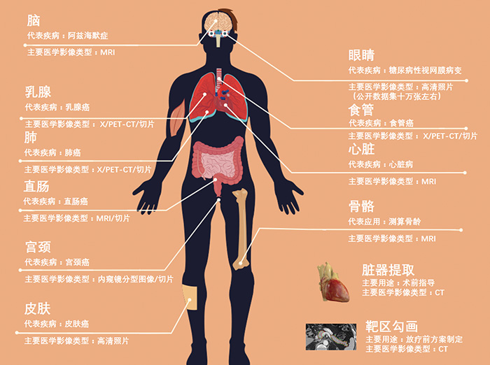
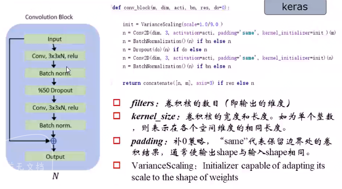

# 深度学习技术在医疗健康行业的应用

医学影像

电子病历

基因组学/个性化医疗

药物发现

移动医疗

## 深度学习在临床检测及医学影像中的应用

在医学影像领域的应用

应用场景

### 计算机视觉任务

- 分类

- 分类及定位

- 目标检测

- 图像分割

### 现代医学影像技术

近三十年的医学影像技术迅猛发展

1. 硬件发展的突飞猛进，包括MR、CT等硬件的发展，这些成像技术让我们得到了很好的影像；

2. 复杂数学工具的利用，通过这些方式可以对医学影像进行重建、分析与处理，从而得到清晰可见的医学图像。

### 医学影像的种类

#### 医学成像设备

医学影像是一种特殊的图像，通过以下设备产生：

1. X线设备：通过测量透过人体的X线来实现人体成像的，即利用人体各组织的密度和厚度不同，X线穿过后的衰减程度不同，来显示身体内部的形态影像。
2. 磁共振成像设备：通过测量构成人体组织元素的原子核发出的磁共振信号来实现人体成像。MRI可反映人体分子水平的生理、生化等方面的功能特性。
3. 超声成像设备：分为利用超声回波的超声诊断仪和利用超声透射的超声CT两大类。超声诊断仪根据其显示方式不同，可分为A型（幅度显示）、B型（辉度显示）、D型（多普勒成像）、M型（运动显示）等。
4. 医用内镜：能够直观地观察人体内部器官的形态的设备，相对其他影像设备其诊断准确性更高。医用内镜的种类很多，其中最常见的有光导纤维内镜和电子内镜。
5. 核医学成像设备：通过有选择地测量摄入体内的放射性核素所发出的γ射线来实现人体成像。此类设备主要有γ相机、PET和SPECT。
6. 计算机断层扫描 (CT)，根据所采用的射线不同可分为：X射线CT（X-CT）、超声CT（UCT）以及γ射线CT（γ-CT)等。

#### 医学成像形态

相比结构性图像，功能性图像的空间解析度较差。

1. 结构性图像：可以得到组织的结构性特征，但无法看到生物有机代谢的情况。

   - X-ray，如血管摄影和电脑断层，它可以看到组织结构；

   - 声音的方法，如超声成像；

   - 荧光，它可以用来探讨组织和细胞的形状与结构；

   - 磁场，如核磁共振，它可以看到脑组织和身体器官的结构；

   - 光学，比如眼底图像，光学相干断层扫描，它可以侦探到身体的结构，帮助诊断。

2. 功能性图像：可以提示代谢的衰变与下降，或功能性的疾病。

   - 光子，如用单光子电脑断层扫描，可以看到代谢状况，不过没法看到组织结构；

   - 正子，如正子断层扫描，它加上一些医学药物的应用，可以看到代谢情况，看到肿瘤和病灶；

   - 血氧水平，如fMRI功能性磁共振；

   - 电流活动，透过脑波图，拓扑到脑部对应位置，可以看到活动状态下脑部电流改变的状况；

   - 磁场，与脑波图类似，通过脑磁图的方法，用磁场侦探微弱电流，可以感应出大脑中的功能性差异。

### 医学影像主流的存储方式

1. DICOM：Digital Imaging and Communications in Medicine医学数字成像和通信标准。

   DICOM标准的推出与实现，大大简化了医学影像信息交换的实现，推动了远程放射学系统、图像管理与通信系统（PACS）的研究与发展，并且由于DICOM的开放性与互联性，使得与其它医学应用系统（HIS、RIS等）的集成成为可能。

   文件头（元数据） + 图像层

2. MHD/RAW

   MHD（元数据）/RAW（原始影像信息，三维）

3. NRRD格式

   包含元数据和RAW信息，并进行了压缩

4. vti、GIPL等格式

### 医学影像开源数据集

1. Github上哈佛 beamandrew机器学习和医学影像研究者-贡献的数据集

   github: https://github.com/beamandrew/medical-data

2. ISBI（生物医学成像国际研讨会）

   下载地址：https://grand-challenge.org/challenges/

3. 

### 医学影像分割

#### 任务

肺结节

MRI影像中的前列腺组织进行分割：判断每个影像是否属于前列腺组织

#### 特点

#### 深度学习模型

U-Net

V-Net

### 数据集来源

prostateX数据集

promise12数据集：下载地址

训练集：50列，测试集：30例

数据格式：mhd/raw格式的MRI影像

label：segmentation

### 深度学习图像分割算法

2D U-NET、3D U-NET、DeeplabV3+  paslvoc

#### 传统图像分割算法

1. 基于图像灰度值阈值的划分
2. 基于区域生长的方法：以灰度色差作为基准

#### U-NET

SimpleITK包解读dicom图像	

图像输入、图像输出

卷积、下采样、上采样（双线性插值、反卷积）

典型的编码、解码框架

### 改进的U-NET

github.com/mirzaevinom/promise12_segmentation (promise12大赛第8名)

- 预处理（增大对比度、去噪）
- 网络体系结构
- 数据增强（弹性变形）

### 图像预处理技术--CLAHE算法

限制对比度自适应直方图均衡

修剪后对比更自然

#### CLAHE算法步骤：

1. 图像分块
2. 遍历、块间双线性插值
3. 。。

#### 曲率驱动的图像去噪

- 高斯滤波
- 等照度线的曲率的绝对值应该足够小

### U-NET详解

U-NET：用于生物影像分割的深度学习模型

数据扩展至15W例、5000W参数、1小时超算、5dayGPU

预测约0.1s

15W-->5W例

#### 目标函数-Dice系数

Dice距离
$$
s = \frac{1XY}{X + Y}
$$

RBM

ReLU

Adam

Dropout是集成学习的一种。

BN

### 数据增强

平移、旋转、扭曲（包括对应的标注数据）

弹性变形

程序修改

- 15W-->5W例

- 目标函数

  交叉熵

  精确度

影响因素

- 

空洞卷积

Mask R-CNN vs U-NET

通用目标分割 vs 生物影响分割

数据增强  测试集与训练集的分布是不是不同了？

为什么说残差模块学到的是残差？

Dice损失函数非处处可导

**医学影像人工智能应用的困难与挑战**

那些宣称AI能战胜医生的标语到底是夸大其实，还是有理有据呢？人工智能医疗影像落地到底有多难？

上海中医药大学附属曙光医院放射科主任，影像教研室主任詹松华