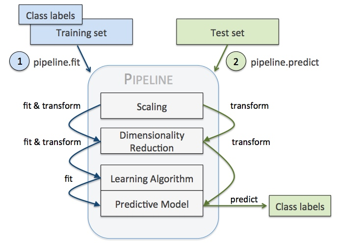

### sklearn 中的 Pipeline 机制

管道机制在机器学习算法中得以应用的根源在于，一些数据处理步骤在新数据集（比如测试集）上的**重复使用**。管道机制实现了对全部步骤的流式化封装和管理（**streaming workflows with pipelines**）。

注意：管道机制更像是编程技巧的创新，而非算法的创新。

如下图所示，利用pipeline，可以将模型训练之前的数据处理、特征工程的步骤用Pipeline封装起来，进行模型验证时，就不需要重复这些步骤，直接调用封装的Pipeline即可，这样在方便地减少代码量同时也让机器学习的流程变得直观。



举例，可以参数模型训练和模型验证两个过程存在代码重复。

```python
vect = CountVectorizer()
tfidf = TfidfTransformer()
clf = SGDClassifier()

vX = vect.fit_transform(Xtrain)
tfidfX = tfidf.fit_transform(vX)
predicted = clf.fit_predict(tfidfX)

# Now evaluate all steps on test set
vX = vect.fit_transform(Xtest)
tfidfX = tfidf.fit_transform(vX)
predicted = clf.fit_predict(tfidfX)
```

利用Pipeline可以将上述过程抽象为：

> 需注意，利用训练阶段的pipeline进行模型预测阶段的数据处理时，pipeline是否包含了训练阶段的数据特征参数。例如，对模型预测阶段的数据进行MinMax归一化时，其min、max参数应该是训练集对应的min、max参数。

```python
pipeline = Pipeline([
    ('vect', CountVectorizer()),
    ('tfidf', TfidfTransformer()),
    ('clf', SGDClassifier()),
])

predicted = pipeline.fit(Xtrain).predict(Xtrain)
# Now evaluate all steps on test set
predicted = pipeline.predict(Xtest)
```

